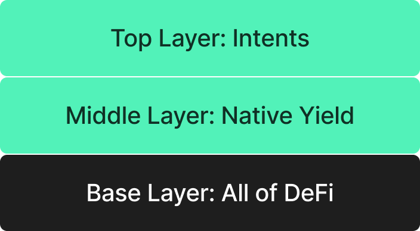

# Learn 
## The Problem

A cross-domain intent protocol like Mantis has become relevant due to several key issues facing the DeFi space:

- **Poor user experience (UX):** Decentralized applications are often not intuitive. Cross-chain operations exacerbate this problem as they typically require a user to navigate between multiple different applications and networks.
- **Suboptimal earnings opportunities:** When a user is not actively using an asset in an account, it typically does not earn yield. This is poor capital efficiency. Moreover, the massive expanse of DeFi makes it hard for users to identify optimal opportunities.
- **Centralization trends:** Decentralization provides a trust-minimized environment. This means that there is no reliance on a third party to behave a certain way. As a result, decentralized structures are more secure, transparent, and resilient to attacks or failures. However, there have been recent trends towards centralization in the multi-chain pipeline, including centralized bridges. Yet, existing decentralized solutions do not rival existing centralized structures in terms of speed or cost.

Now, new technologies are being introduced that help solve these problems. This includes trust-minimized bridging structures like [Picasso](http://picasso.xyz). These developments enable generalized message passing and synchronization of protocols and applications across multiple blockchain ecosystems.

Intents are another new area of development in DeFi and are positioned to further assist in resolving cross-chain operational issues. For instance, intents-based protocols have already processed significant volume: [UniswapX has processed over $10 billion](https://dune.com/phu/uniswapx) in notional volume and [CowProtocol has processed over $2 billion](https://dune.com/cowprotocol/cowswap-high-level-metrics-dashboard?Aggregate+by_e759c2=Week) as of June 2024. This demonstrates the significant impact and adoption of intents in the market already.

:::info
**Understanding Intents**

Intents have become a hot topic in DeFi. In general, intents are understood to be users’ desires for a given transaction or other outcome. Intents include desired parameters such as to swap X amount of A token for B token. But, intents also leave some room for flexibility such as where this swap occurs.

Anoma does a great job of breaking down the history and various definitions of intents in [this blog](https://anoma.net/blog/intents-arent-real) about their Intents Day event. [This blog](https://blog.essential.builders/introducing-essential/) by Essential also provides another means of defining intents and solvers.
:::

Intents are important in DeFi since they can improve the user experience. They can carry out all types of cross-domain transactions while abstracting away the complexity involved in this process. **With intents, users do not have to spend time identifying the best opportunities to satisfy their goals only to find that these opportunities are no longer available by the time that they have explored all options.** Mantis and its intent settlement framework do all of this for the user in short order.

However, many existing intents solutions are not cross-chain interoperable or vertically integrated with execution and settlement. This means that users can not leverage them for cross-chain transactions. These protocols are also unable to accrue value from pay-for-order-flow (PFOF). In PFOF, a market maker pays a broker for routing their clients’ trades to a market maker. Thus, market makers benefit from increased order flow and thus increased earnings. Brokers also earn money by effectively selling the order flow of their users to market makers. Moreover, clients can benefit from reduced trading costs as PFOF can be leveraged to at least partially cover user fees.

## The Solution

**Mantis allows end users to tap into DeFi from a single point of entry: simply entering their intents for a desired outcome into the Mantis interface.** From there, Mantis handles the rest. This includes:

- Expression of the intent to solvers
- Execution of the intent
- Settlement of the intent as a finalized transaction

Mantis also introduces native yield. Users holding assets on the Mantis rollup will earn native yield from the L1. This increases capital efficiency: users’ assets are not stagnating when not being actively used.

Combining native yield with optimized chain-agnostic intent settlement provides users with a yield-bearing way to interact with the entirety of the crypto space. Users simply load their accounts on Mantis, submit intents to be optimally settled via our solver network, and earn yield on their assets in the process:

The cross-chain transaction user experience further improved because of the following characteristics of Mantis:

- **User Friendly:** Mantis provides an intuitive interface of intents where users can specify their desired outcome for a cryptocurrency transaction in simple terms.
- **Streamlined:** Mantis abstracts away the complexities of cross-domain communication.
- **Secure:** Mantis secures user funds by requiring solvers to provide a stake before handling these funds. Mantis also removes reliance upon any centralized entity which can negatively influence a user’s goals.
- **Optimized:** Solvers provide optimal solution routes to intents. Whenever possible, solvers use cross-domain Coincidence of Wants (CoW) matching to further maximize users' returns by minimizing fees.
- **Incentivized:** Mantis offers democratized revenue sharing for participants such as block producers, validators, searchers and relayers. These players are incentivized via competition to perform their roles to the best of their abilities.

**To summarize, Mantis is an ecosystem-agnostic intent settlement framework. This framework is powered by the Mantis rollup. The Mantis protocol facilitates a network of competing solvers that devise solutions aimed at optimizing user results.**

# Whitepaper

The Mantis whitepaper is available [here](https://assets.website-files.com/65b28e756a8eda2e91e76ca4/6656289f21123d6215091555_MANTIS%20Whitepaper.pdf).

# Litepaper

The Mantis litepaper is available [here](https://assets.website-files.com/65b28e756a8eda2e91e76ca4/6655e8e69277b97e9c11c793_MANTIS%20Litepaper.pdf).
