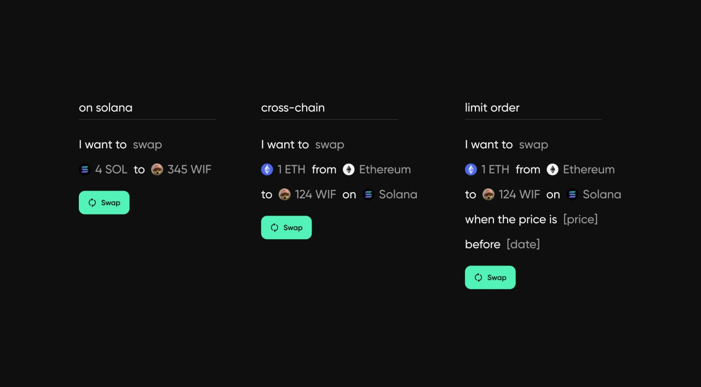

# Mantis Use Cases

### UX: Execute Anywhere from One Location

Crypto users need to take many steps to hunt for the best opportunities. There are lots of people on X that know what they’re doing and suggest/curate DeFi strategies for the average user. Still, the steps might be unclear or daunting.

Mantis thus introduces a platform that is natively cross-chain and simplifies the overall crypto user experience (UX). Mantis vastly improves the UX by carrying out all types of cross-domain transactions and abstracting away the complexity involved in the process. With Mantis, users do not have to spend time identifying the best opportunities to satisfy their intents, only to find that these opportunities are no longer available by the time they have explored all options. Instead, the best opportunities are identified and executed upon by Mantis.

Overall, users are able to execute anywhere that is IBC-enabled directly from the Mantis app.

Since Mantis makes DeFi more accessible and appealing, the broader industry is better positioned for mass adoption.

### Future Explorations

There are a number of ways in which Mantis envisions expanding and improving our Mantis intent settlement framework. These areas of research are described in [our Research Forum](https://research.composable.finance/t/the-research-rfp-program-current-rfps/309).
