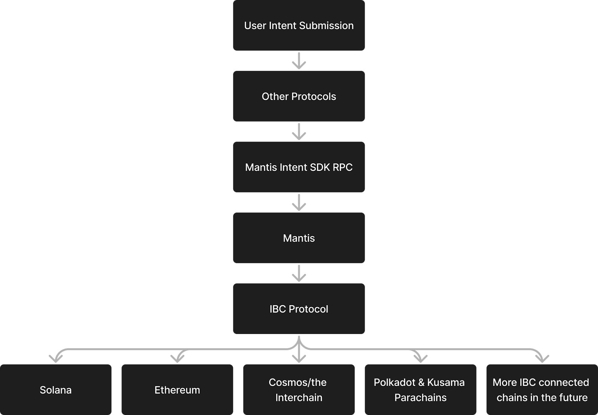

# Develop

### How to Install Rust

1. Install Rust:
```
curl --proto '=https' --tlsv1.2 -sSf https://sh.rustup.rs | sh
```

2. Verify installation:
```
rustc --version
```

### How to Setup .env
1. 
Create a .env file in the project root:
```
touch .env
```

2. Add these variables:
```
ETHEREUM_RPC=""
ETHEREUM_PKEY=""
SOLANA_KEYPAIR=""
```

3. How to Run Commands

Use this structure:
```
cargo run -- [COMMAND]
```

Example commands:
Solana single domain:
```
cargo run -- solana <amount_in> <token_in> <token_out> <amount_out> <timeout>
```

Ethereum single domain:

```
cargo run -- ethereum <token_in> <amount_in> <token_out> <amount_out> <timeout>
```

## Requesting API Keys

Please fill out [this form](https://docs.google.com/forms/d/e/1FAIpQLSdc-jOpCJ3djIbcrPWK2dc700AVclA0aYJiwgL6hOvTC4FMmQ/viewform?usp=sf_link) to request Mantis API keys.

## Explorer for Rollup

We’re using Solana explorers:

- [Solscan](https://solscan.io/?cluster=custom&customUrl=https://mantis-testnet-rollup.composable-shared-artifacts.composablenodes.tech/rpc)
- [Solana Explorer](https://explorer.solana.com/?cluster=custom&customUrl=https%3A%2F%2Fmantis-testnet-rollup.composable-shared-artifacts.composablenodes.tech%2Frpc)

WS: [ws://35.241.172.68:8900]

RPC: [https://mantis-testnet-rollup.composable-shared-artifacts.composablenodes.tech/rpc]

Faucet: [http://35.241.172.68:9900]

Testnet

## Testnet

RPC: [https://mantis-rollup.composable-shared-artifacts.composablenodes.tech/rpc]

WS: [https://mantis-rollup.composable-shared-artifacts.composablenodes.tech/ws]

Explorer #1: [https://solscan.io/?cluster=custom&customUrl=https://mantis-rollup.composable-shared-artifacts.composablenodes.tech/rpc]

Explorer #2: [https://explorer.solana.com/?cluster=custom&customUrl=https%3A%2F%2Fmantis-rollup.composable-shared-artifacts.composablenodes.tech%2Frpc]

# Faucet

[https://mantis-rollup.composable-shared-artifacts.composablenodes.tech/faucet]

Deploying Smart Contracts on the Rollup

# How to Deploy Smart Contracts on the Mantis Rollup

Contracts deployment works exactly [the same](https://solana.com/docs/programs/deploying) as on Solana, but notice that working with the chain and the SPL contracts may be different (see the section below).

Mantis contracts are deployed to the Solana blockchain the same way as other Solana programs (or smart contracts). Download and run the script in order to install the Solana CLI. More details can be found [here](https://solana.com/docs/intro/installation#install-the-solana-cli).

Once the Solana CLI is installed, it can be used to deploy programs to the blockchain with the following command:

```
solana program deploy &lt;PROGRAM_FILEPATH&gt;
```

Here, &lt;PROGRAM_FILEPATH&gt; is the executable to be deployed. Optionally, the –-program-id parameter can be used to provide a path to a JSON file containing a keypair which should be used for deployment. See [here](https://docs.solanalabs.com/cli/examples/deploy-a-program) for more details.

A quick guide on how to develop a Solana program is available here[here](https://www.quicknode.com/guides/solana-development/anchor/how-to-write-your-first-anchor-program-in-solana-part-1).

## Chain-Specific Changes

Mantis is a fork of [Jito](https://github.com/jito-foundation/jito-solana), which means it supports some features of Jito such as [transaction bundles](https://docs.slerf.tools/english-en/solana-guide/jito-bundle) that can be useful for an MEV rollup..

Also, Mantis uses a [modified](https://github.com/ComposableFi/solana-program-library/tree/mantis) version of SPL programs, in particular, spl-token: it adds an additional \`supply_on_l1\` field to the Mint account of a token that is used to render the proper amount on the UI when dealing with rebased tokens.

# How to Route Orderflow Through Mantis

Projects can send intents through Mantis by integrating our protocol. From here, these intents will be optimally settled by the Mantis solver network.

The easiest way to interact with the Mantis protocol is to use the Mantis intents SDK. However, it is also possible to use the escrow contracts that have been created on each blockchain supported by Mantis to facilitate the intent system. We describe both options below.

## Revenue Share

In the future, projects sending unique orderflow through Mantis can also earn a percentage of revenue. They will be able to select this percentage.

## The Mantis Intents SDK

The Mantis Software Development Kit (SDK) is a developer toolkit that enables seamless integration with and construction on the Mantis Protocol and Rollup. The repo for the Mantis Intents SDK is available [here](https://github.com/ComposableFi/mantis_sdk/blob/main/README.md).

The Mantis intents SDK:

- Enables any application to access Mantis by pointing to the Mantis RPC
  - This enables generalization of intents
- Interacts with the expression layer of Mantis
- Allows Mantis to act as back-end processing and chain abstraction for AI agents and telegram bots

As a result, protocols and applications are able to tap into the benefits of Mantis:

- User friendliness
- Streamlined chain abstraction
- Security and trust-minimization
- Optimized routing
- Incentivization for ecosystem participants

Many projects within the DeFi space can leverage Mantis by tapping into the remote procedure call (RPC) of the Mantis Intent Software Development Kit (SDK). This is shown below:



Some examples of these projects that can benefit from integrating Mantis are as follows:

**Crypto Wallets:** Wallets can use Mantis to become intent-centric. This allows their users to submit intents for their desired crypto transaction outcomes. Intent settlement will then be carried out and optimized by Mantis solvers. Intents are executed on any chain that is connected to IBC using the optimal solution achieved. This delivers best execution for users while providing a streamlined UX within the existing wallet UI.

**Order Flow Originators:** Any protocols that originate order flow can integrate Mantis to process orders. This can make these protocols intent-centric and provides chain-agnostic intent settlement over IBC.

**Trading Bots:** Bots’ strategy algorithms can use Mantis-based trading opportunities. Settlement of these trades will then be optimized by Mantis solvers, providing best execution to users. Bot projects benefit from this opportunity financially; any bot that has partnered with Mantis and directs unique order flow to Mantis automatically receives that revenue share, once Mantis processes the given order.

**AI Agents:** Artificial intelligence (AI) agents can partner with Mantis to enable strategically timed swaps along the Mantis protocol. Partner protocols’ existing tech stacks can be used to generate these AI agents. AI agents will then submit user intents at optimal times to Mantis. Intent settlement will be further optimized by Mantis solvers. Similarly to partner trading bots, partner AI agents also receive revenue based on order flow origination. Specifically, any AI agent that has partnered with Mantis will receive a revenue share when they have successfully directed unique order flow to Mantis.

**Order Flow Destinations:** DeFi protocols can integrate Mantis to receive order flow from the platform. Order flow destinations include DEXes, lending protocols, or derivatives platforms.