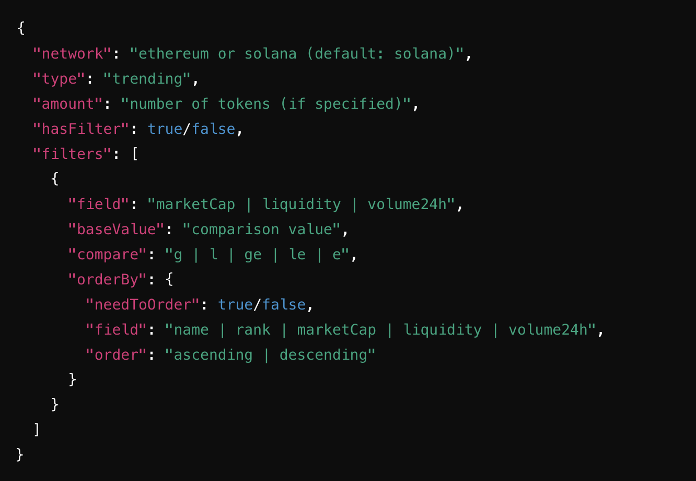
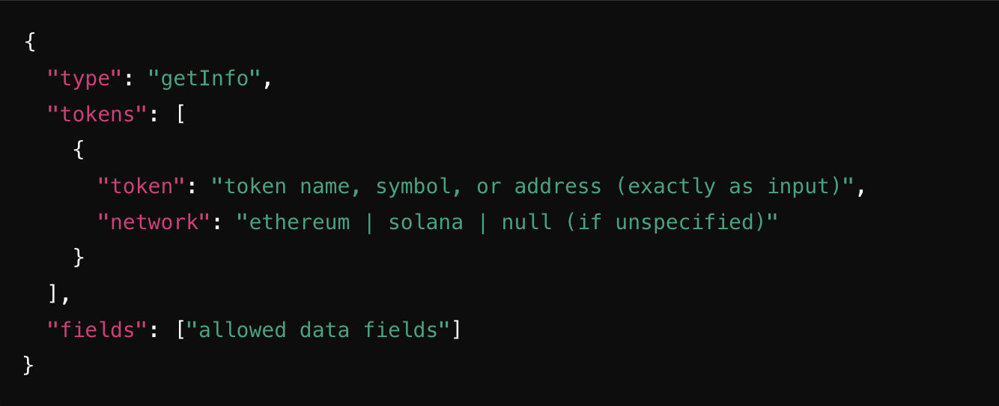
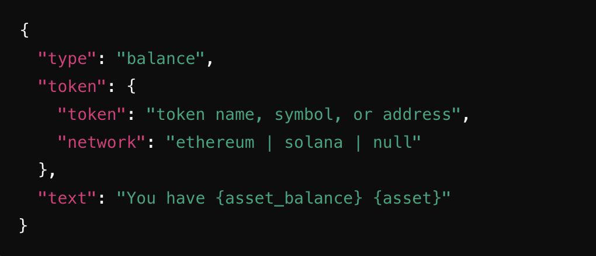
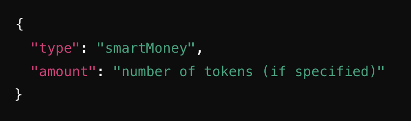
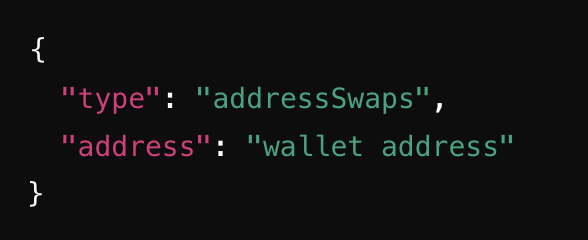
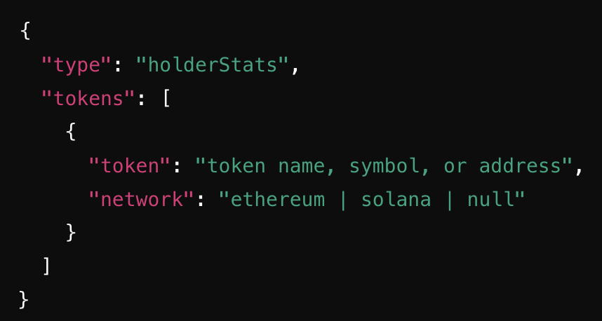
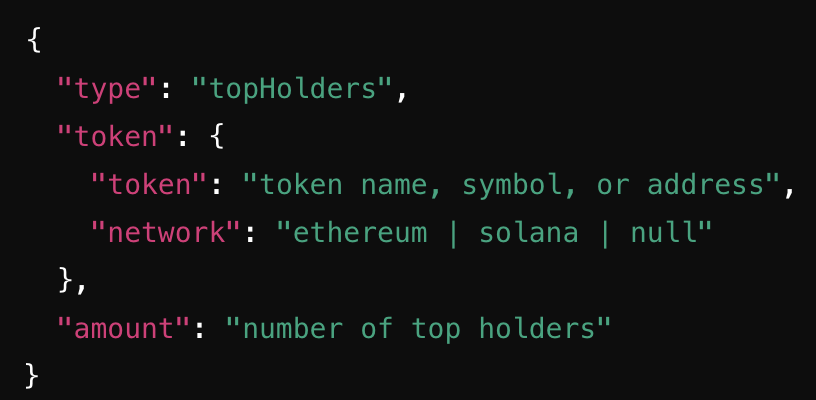

# Promt Guide

**Overview**
DISE LLM is Mantis’s proprietary framework designed to power personal AI agents for cryptocurrency trading. It aggregates market insights and on-chain data while translating human language into cryptocurrency trading activities. Users provide text input describing their desired actions, and DISE LLM interprets these commands into structured JSON objects for execution.

## Processing User Input

1.  **Understanding the Request**
    *   DISE LLM first evaluates the user's input and, if unclear, references previous messages for context.
    *   It determines the intended action based on predefined categories:

  
**Possible Actions:**

*   **Buy:** Execute asset swaps (buy/sell trades), possibly across networks.
*   **Research:** Retrieve market insights, token data, or general crypto information.
*   **Chat:** If the input is conversational and unrelated to trading, a friendly response is generated without emphasizing the crypto trading assistant role.
    *   If the request is unclear, DISE LLM merges it with previous messages to infer the intended action.
    *   If no clear action is identified, it defaults to "chat", prompting the user for clarification.

**Prompting Examples:**

Prompting falls under 3 main categories

*   Buy/Sell:
    *   ‘I want to **buy** **10 SOL** for **USDC**’
*   Research:
    *   ‘Show me **10 trending tokens** on **Solana**’
    *   ‘What is the **marketcap** of **AAVE** ?’
    *   ‘What is my **SOL balance** ?’
    *   ‘What are **smart money** wallets for **JITO** ?’
    *   ‘Can you tell me the recent **trade history** of **solana\_address** ?’
    *   ‘Who are the **top holders** of **JUP** ?’
*   Chat

## Research Action

If the action is "research", DISE LLM determines what the user wants to learn and structures the response accordingly.

1.  **Trending Tokens**
    *   If an invalid filter or ordering field is provided, DISE LLM returns an error message.

2.  **Token Information**
    *   **Allowed fields:** marketCap, liquidity, price, creationTime, price history (e.g., 30m, 1h, 2h, etc.), buy/sell counts (various timeframes).
    *   Closest estimates are used for unspecified timeframes.
 

3.  **Token Balance**
    *   Only supports checking balance for **one token at a time.**
    *   If no token is specified, an error message is returned.

4.  **Smart Money Activity**
    *   Returns information on tokens that top traders or whales are buying.
    *   \*Only available for Solana. If requested for Ethereum, an error is returned. 

5.  **Address Trade History**
    *   Returns latest trades/swaps for a specified address.

6.  **Holder Statistics**
    *   Provides holder count, top holders’ control, etc. 

7.  **Top Holders of a Token**
    *   Returns top token holders.
    *   Supports only one token per request.

8.  **Tokens with the Highest Volume**
    *   Returns the top 5 volume DEX pairs on Solana
9.  **Latest Trades for an Address**
10. **General Structure for Research Requests**
    *   The returned JSON includes a "prefix" field with an introductory response and a "suffix" field suggesting a next action or question.
    *   Only predefined research types are allowed.

## Trade Execution

**If the action is "buy", DISE LLM structures the trade request.**

1.  **If the user does not specify amounts for tokens to buy/sell, it prompts for clarification:**
2.  **If amounts are specified, the response includes trade details:**

*   _If amounts are inferred, the response includes clarifications._
*   _Example response message:  
    "Sure, half of your asset\_in equals asset\_in\_amount. You will swap asset\_in\_amount asset\_in for asset\_out\_amount asset\_out. Would you like to proceed?"_