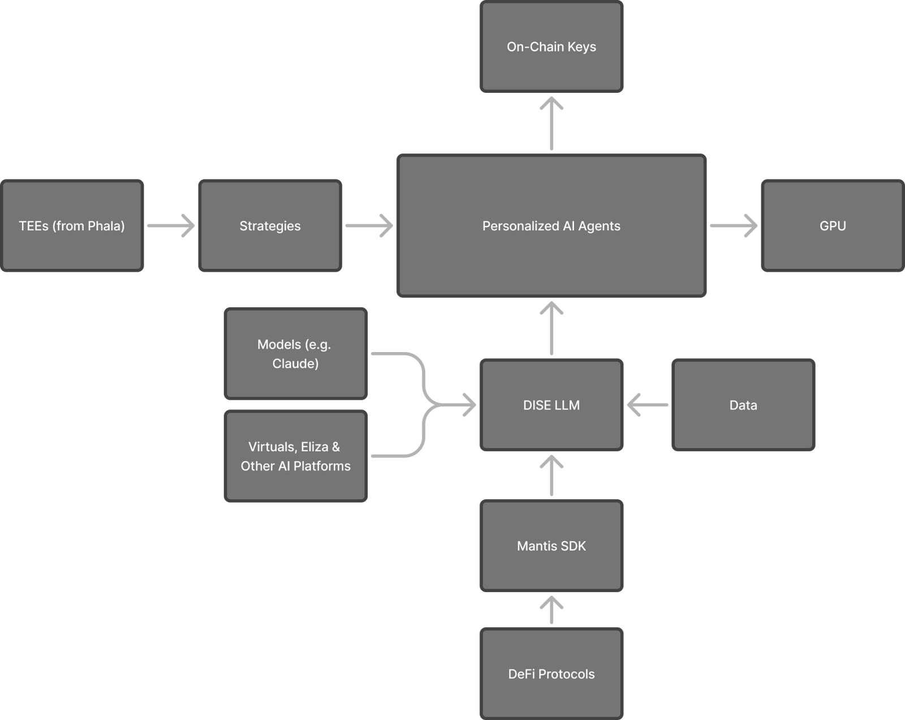
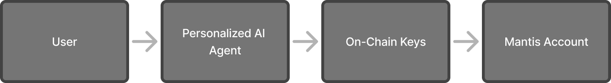
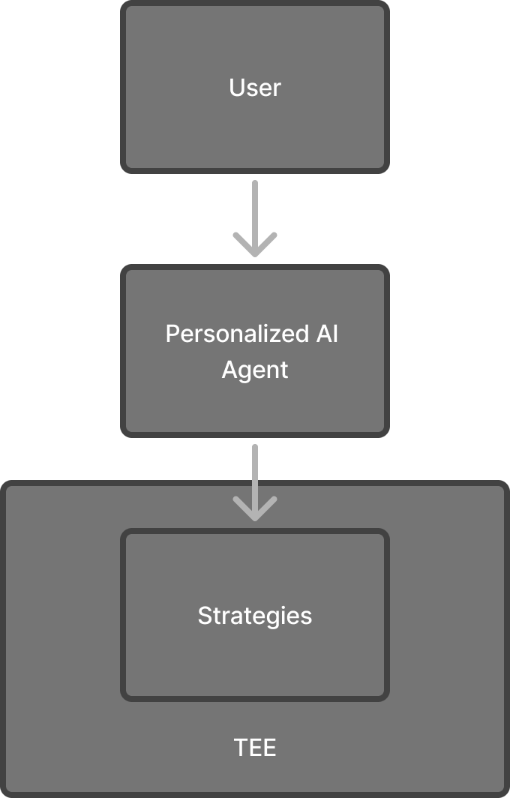
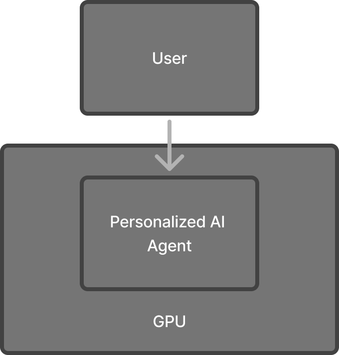

# DISE LLM 

Mantis’s proprietary DISE large language model (LLM) is the framework powering personal AI agents on Mantis. DISE is trained specifically with the Mantis SDK framework to make intelligent swaps and execute complex commands across Ethereum, Solana, and beyond.

## Tech Stack for AI

At its core, [Mantis is a platform for DeFAI](https://x.com/mantis/status/1876720477030494574): the intersection of decentralized finance (DeFi) and AI. This is accomplished through the Mantis tech stack, which is vertically integrated.

With this model, AI agents have control over monetizing their own orderflow, and the best possible execution. Moreover, Mantis’s vertical integration mirrors successful comprehensive FinTech applications. DISE parallels banking services, with its ability to securely manage user funds. The introduction of conditionality to DISE will be similar in functionality to brokers, in that more complex preferences can be expressed and upheld. Finally, AI management of vault strategies mirrors the earn products seen in FinTech, which power yield for users.

*   Personalized AI agents are the central focus
*   Each AI agent will reside in a GPU to keep data unique to each user
*   AI agents’ strategies will be housed in TEEs for a similar reason
*   AI agents will be powered by the DISE LLM
*   DISE takes in information from various on- and off-chain sources like various models and other AI frameworks
*   The Mantis SDK can also be used by any DeFi protocol to tap into the Mantis framework and execute swaps through DISE
*   DISE takes in all of this information and produces data, which is used to inform AI agents on Mantis
*   On-chain keys enable AI agents to have secure access to user funds, and thus act on behalf of users

In this manner, Mantis delivers a full suite of products for AI-powered financials. Each component is detailed below:

## Introducing Personalized AI

The next product being introduced by Mantis is custom AI agents associated with Mantis accounts that learn from an individual user’s wants and needs. These agents will be able to facilitate instant swaps on behalf of users.

Core features powering personalized AI on Mantis are DISE, the Mantis SDK, and Lady Mantis:

### DISE

Personalized AI will be facilitated by DeFAI Interactive Search Engine (DISE). DISE is our proprietary AI core. It aggregates market insights like social media and on-chain data.

More specifically, DISE is a large language model (LLM) that is plugged into ai16z’s [Eliza](https://elizaos.ai/) in order to spin up AI agents. It is written in Typescript.

Because of DISE, users can type out actions and have their AI agents search for the best swaps using plain language. Initially, compatible actions will include any sort of swap/bridge on or between Ethereum and Solana.

The purpose of DISE is to aggregate information in order to help users make informed decisions about what to swap. In its first iteration, DISE will be able to perform the following functions:

*   Swapping tokens on/between Ethereum and Solana via Mantis
*   Fetching token overviews
*   Filtering tokens by different qualities (for example, take tokens x, y, and z and filter with liquidity of over $1 million)
*   Order tokens by different qualities (for example, take tokens x, y, and z and order by marketcap)
*   Tracking smart money
*   Fetching trades by address
*   Fetching trending tokens (for example, what tokens people are aping into or talking about the most)
*   Fetching liquidity (for example, the latest DEX liquidity for a given token)
*   Fetching prices (for example, the latest block price for a token during a set time window)
*   Fetching profits and losses (PnL) for a given address
*   Fetching tokenholder stats (for example, the token holder count and change in holders during a set time window)
*   Fetching top holders and holder concentration (for example, the percent of tokens held by the top 10 addresses)
*   Fetching tokens with the highest amount of volume
*   Fetching token creation time
*   Fetching number of buys and sells
*   Fetching average buy/sell size and number of buys/sells for a token

DISE is also able to learn from a user’s individual preferences and actions. For example, if a user often asks DISE about memecoins, DISE will recognize this pattern and begin automatically providing information and recommendations for memecoins. You can further influence the “personality” of your AI agent on Mantis by using other AI agents platforms like [Virtuals](https://app.virtuals.io/) or [Eliza](https://elizaos.ai/) to train your own AI agent.

Check out some demos here:

1. <blockquote class="twitter-tweet" data-media-max-width="560">
1/ The era of DeFAI is here. 🚀  Meet Mantis: the next-gen AI for DeFi. With Mantis, interacting with decentralized finance is as easy as typing a command.  No more imagining. It&#39;s happening now.  Here&#39;s how we completed a complex trade with a few natural prompts—and unlocked… <a href="https://t.co/HoYo5vNp6Z">pic.twitter.com/HoYo5vNp6Z</a>
&mdash; Mantis (@mantis) <a href="https://twitter.com/mantis/status/1878094789561946313?ref\_src=twsrc%5Etfw">January 11, 2025</a></blockquote> 
2. <blockquote class="twitter-tweet" data-media-max-width="560">
1/ The era of DeFAI is here. 🚀  Meet Mantis: the next-gen AI for DeFi. With Mantis, interacting with decentralized finance is as easy as typing a command.  No more imagining. It&#39;s happening now.  Here&#39;s how we completed a complex trade with a few natural prompts—and unlocked… <a href="https://t.co/HoYo5vNp6Z">pic.twitter.com/HoYo5vNp6Z</a>
&mdash; Mantis (@mantis) <a href="https://twitter.com/mantis/status/1878094789561946313?ref\_src=twsrc%5Etfw">January 11, 2025</a></blockquote> 

### The Mantis SDK

The [Mantis Intents Software Development Kit (SDK)](https://github.com/ComposableFi/mantis_sdk/blob/main/README.md) is the execution framework for AI agents on Mantis.This developer toolkit enables seamless integration with and construction on the Mantis Protocol, allowing AI agents and other orderflow originators like DeFi protocols to send swaps and execute transactions. The Mantis SDK routes through the Mantis solver network so AI agents have optimized, cross-chain execution.

### Lady Mantis

The Lady Mantis AI agent drives insights for personal AI agents on Mantis. Lady Mantis aggregates real-time market data and sentiment, serving as a hub of intelligence for the Mantis ecosystem. Find Lady Mantis posting to X [here](https://x.com/xladymantisx).

## State Management

Mantis uses Claude and Anthropic to maintain the context associated with user inputs.

## Models

*   **Agent-to-Agent Learning:** Mantis agents continuously learn from one another, improving their decision-making and strategy optimization.
*   **Dynamic Evolution:** As new functionalities are introduced, agents automatically incorporate them, staying ahead of market trends.

## On-Chain Key Management

On Mantis, personalized AI agents will need to sign and execute transactions on behalf of users. It is important that this is done in a trustworthy and secure manner. This will be accomplished securely via distributed key management: user keys will be split across nodes so that there is no single point of failure.

Specifically, we are working with [Nillion](https://nillion.com/) to implement their threshold Elliptic Curve Digital Signature Algorithm (tECDSA). This tool facilitates secure messaging and signing while protecting a user’s private keys within Nillion’s distributed network. Security is maintained by splitting the user’s keys across nodes. Keys will never be reconstructed, even during signing operations. From here, users can grant their AI agent access to their signing keys without the actual keys being exposed.

Effectively, for each user, there will be an AI agent that is able to manage that user’s account via on-chain keys (1 user = 1 agent = 1 account):

This will be compatible with account abstraction: Users will be able have their AI agents manage several of their accounts simultaneously.

## TEEs

The strategies created by AI agents on Mantis will operate along Phala’s network of trusted execution environments (TEEs):

TEEs are secure areas located in a device’s main processor. These execution environments are inaccessible to any external processes and computations. The result is trust minimization and protection against security threats. Moreover, TEEs authenticate and verify computations happening internally.

Through Phala, NVIDIA’s GPU TEE will be used to provide confidential services for the DISE LLM. For technical details on how this works, check out Phala’s documentation [here](https://docs.phala.network/confidential-ai-inference/host-llm-in-tee).

As a result, Mantis AI agents' unique strategies and trades will be optimally protected from security threats; model execution, user data, and processing will remain fully private and secure.

## GPUs

Initially, each personalized AI agent will be hosted by Mantis internally. Eventually, we will have an architecture where every agent is hosted on its own graphics processing unit (GPU). This keeps data for each user separate. In essence, 1 user = 1 agent = 1 GPU:

These specialized electronic circuits are able to perform high volumes of processing and calculations. This will provide compute power for personalized AI agents on Mantis. This will also allow full decentralization of AI agents, which is a priority for Mantis.

## The Mantis Solver Network & Cross-Chain Execution

Solvers on Mantis compete to provide the best execution for orderflow. Read more about the Mantis solver network [here](https://docs.mantis.app/protocol/solvers).

Cross-chain settlement of AI-generated orderflow on Mantis is carried out over [Inter-Blockchain Communication (IBC) Protocol](https://ibcprotocol.dev/) connections. Thanks to the [Picasso Network](https://www.picasso.network/)’s work expanding IBC, Mantis is natively interoperable with both Solana and Ethereum.
