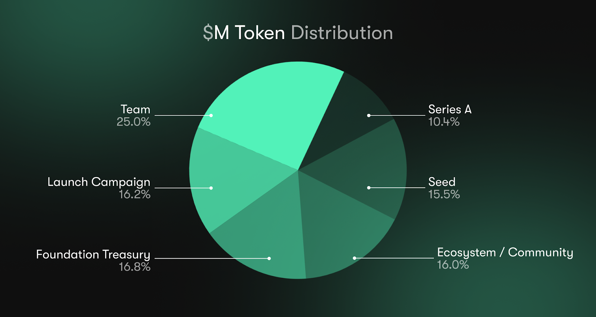
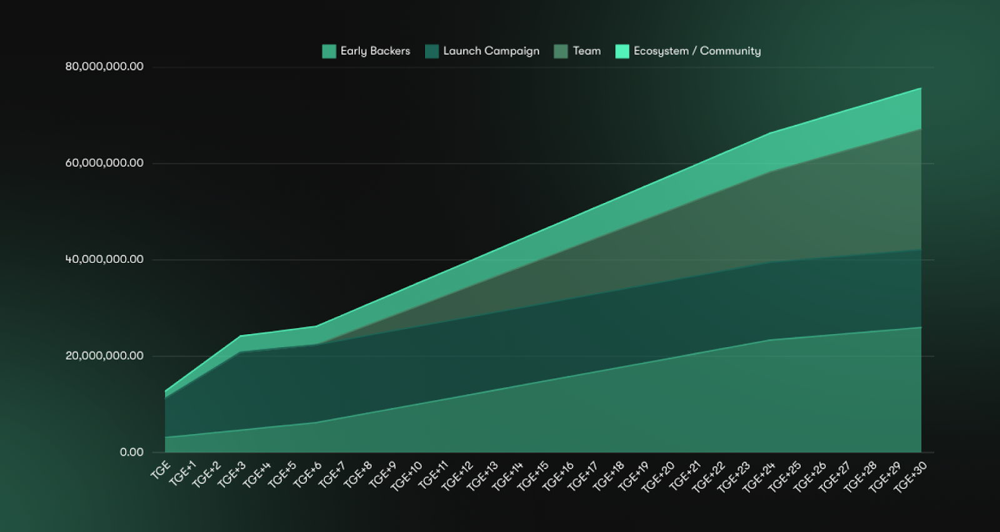

# $M Token

M is the native token of Mantis protocol. It strives to support the Mantis framework and its users while pushing the overall ecosystem further along its decentralization pipeline.

*   **Token Ticker:** $M
*   **Total Supply at Genesis:** 100,000,000
*   **Percentage Distributed to the Mantis Community and Ecosystem:** 32.2%
*   **Token Decimals:** 9
*   **Token Standard:** SPL-20
*   **Network:** Solana
*   **Contract Address:** [Mant1sZcb8x2YMZe7RdqSfStCj4YxjmQByNKyHpLJK9](https://solscan.io/token/Mant1sZcb8x2YMZe7RdqSfStCj4YxjmQByNKyHpLJK9)

## Token Distribution

The $M token will have an initial supply of 100,000,000 tokens. $M tokens will be minted on Solana L1. Approximately a third of $M tokens (32.2%) will be allocated to the Mantis community via TGE launch campaign and Ecosystem allocations. This includes a launch campaign airdrop, and allocation toward future ecosystem and community initiatives.

**M Token Distribution:**

**Mantis Network ($M) Token Unlock Schedule:**

### Launch Campaign - 16.2%

Our top priority is supporting our users. That includes taking care to reward our earliest participants while also sparking the interests of the next wave of users. Thus, upon the $M token generation event (TGE), we’ll be hosting an airdrop where around 16.2 million $M tokens will be distributed to:

*   **Launch Campaign Participants**
    *   Mantis season 1, 2, and 3 users
    *   Mantis app users 
*   **NFT Communities**
    *   Milady NFT holders
    *   Mantis NFT holders
*   **Crowdloan and Ecosystem Supporters**
    *   Composable Polkadot Crowdloan participants
    *   Picasso (PICA) Token Stakers
    *   Composable Vault Strategy participants
    *   Instrumental (STRM) token holders
*   **Infrastructure Partners**
    *   Solana IBC validators

### Ecosystem/Community ~ 16.0%

We believe that a strong ecosystem of active users and partner protocols is incredibly important. Their contributions, collaboration, and feedback is invaluable. Accordingly, approximately 16 million $M tokens will be allocated to partner protocols and ecosystem incentives. This will enable continued support, growth, and development of the Mantis framework.

### Foundation Treasury - 16.8%

Approximately 16.8 million $M tokens will be allocated to the Mantis Foundation Treasury, which will strive to support the growth, development, and utility of the Mantis ecosystem.

### Seed Backers - 15.5%

15.5 million $M will be allocated to these early supporters of Mantis Network who helped make it possible to build.

### Series A Backers - 10.4%

10.4 million $M will be distributed to these additional early supporters of the Mantis Network.

### Team - 25%

Allocated to core contributors of Mantis supporting continued development and growth of the protocol and ecosystem.

## Token Utility

The $M token is the native token for the Mantis framework, and was created to help fulfill long-term goals of the Mantis ecosystem. Mantis plans to propose various $M token use cases via decentralized governance. Utilities for the $M token that we plan to propose include:

### Network Security/Decentralization

$M token may be staked to secure the Mantis rollup. $M token is also used to decentralize the network validators

### Value Accrual for Token Stakers

A portion of value generated on Mantis will flow to $M token stakers as a reward for helping to secure the Mantis network. This includes a percentage of the following value sources:

*   Value from native yield
*   Value from swaps
*   MEV generated

### Governance Rights

At Mantis, we believe it is important for the community to have a significant role in decentralization and governance of the ecosystem. Thus, the $M token is used for governance of the Mantis framework, with tokenholders being able to propose/discuss governance initiatives via the [Mantis Governance forum](https://forum.mantis.app/) and then vote on these initiatives via [Realms](https://www.realms.today/).

### Fee Sharing & Discounts

M token stakers will be eligible for receiving a portion of fees accumulated on Mantis. They will also be able to receive discounted fees themselves.

### Solver Bonds

The $M token will be used to provide entrance bonds for solvers to enter the network. These bonds will also be used to hold solvers accountable for downtime/execution failures via slashing.

### AI Agent Launching

The $M token will be used to provide entrance bonds for AI Agent onboarding; new AI agents onboarding to Mantis must pay this bond to join the ecosystem, disincentivizing spam and other misbehavior.