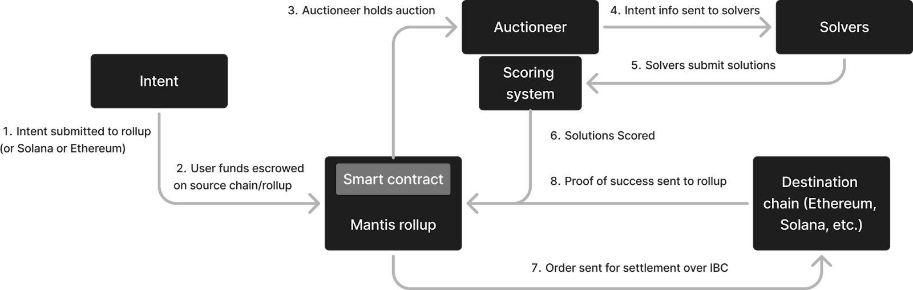

# The Mantis Protocol

On the Mantis rollup resides the Mantis protocol that facilitates optimal execution of cross-domain intent via a competition of solvers. In this protocol, users sign intents which are contained on a private rollup mempool. Solvers are staked agents that can a) observe the intents in the mempool and b) post solutions to intents in the auctioneer contract. The auctioneer contract scores the solutions based on how well they fit constraints the user has set. The winner of the auction is responsible for settling the intent solution they have proposed.

## Mantis V1

In its first iteration, the architecture of Mantis v1 is as follows:

1. Intents (preferences for a cross-chain transaction) are submitted to the Mantis interface via the Mantis rollup directly or via another IBC-connected chain like Solana or Ethereum.
2. User funds are escrowed on the source chain or the rollup (where the intent is submitted).
3. All intents then flow to the Mantis rollup. From here, a smart contract on the Mantis rollup sends intents to an off-chain auctioneer.
4. Information on intents is sent to solvers.
5. Solvers submit solutions (e.g. the output amount of a swap) for user intents to the rollup.
6. Solutions are scored off-chain by the auctioneer.
7. Once the winning solution is determined, the solver that proposed it must execute the intent. he solver makes the necesary state transitions to the respective destination chains.
8. Once the intent solution is executed, proof of success is sent to the rollup and the source chain via IBC.

This architectural flow is summarized below:

## Intent Lifecycle

The lifecycle of an intent on the Mantis protocol is as follows:

1. The user expresses and signs an intent.
2. The intent is sent to the intent database/mempool of the Mantis rollup.
3. For a period of time, solvers propose different solutions to the intent. They submit these solutions to auction smart contracts on the Mantis rollup.
4. The off-chain auctioneer holds an auction to score solutions, prioritizing best execution and adherence to any constraints set by the user.
5. Based on these scores, the auctioneer picks the winning solution.
6. The solver who proposed the winning solution must execute this solution on the destination chain. The IBC is used to unlock user funds. In case of the solver intent is not executed, a proof is send via IBC.
7. If the winning solver misbehaves (by not settling the transaction or by settling it in a way that does not align with their proposed solution), they will be slashed.

This lifecycle is depicted in the diagram below:

(insert image)

## Trust Assumptions

Trust assumptions of Mantis include:

**The IBC Protocol:**

IBC is used for cross-domain verification of intents. IBC was selected as Mantis’s mechanism because it is trust-minimized. An explanation of IBC’s trust minimization compared to other bridging mechanisms is available [here](https://medium.com/@Picasso_Network/ibc-as-the-end-game-of-bridging-a-comparison-analysis-on-trust-dcc01e0d9377).

**The Auctioneer:**

On Mantis, trust is placed in the auctioneer (initially, an off-chain actor) to deposit escrowed user funds. However, the auctioneer's power is limited in scope. They can, at most, censor intents and solutions. They do not hold users' funds at any point in the process. Once a solver submits a solution, proof of this submission is made via IBC. This eliminates the need for trust in the auctioneer at this stage.

The interests of the auctioneer are generally aligned with those of solvers and users. Better solutions typically result in higher fees paid to the auctioneer. The result is an incentive for fair and efficient operation. While off-chain agreements between solvers and the auctioneer are theoretically possible, such collusion would likely be statistically observable by other solvers. This provides a form of checks and balances within the system.

This structure aims to create a trustless or trust-minimized environment where the auctioneer's role is important but constrained. Moreover, multiple parties have incentives to maintain the integrity of the system.
