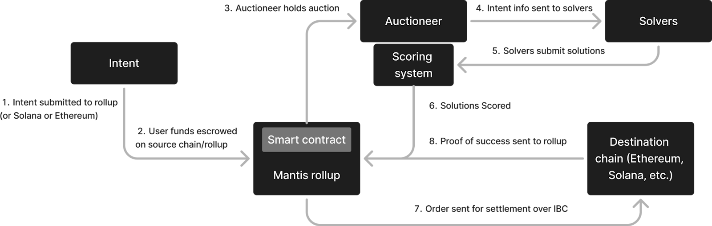

# The Mantis Protocol

The Mantis protocol  facilitates optimal execution of intents via a competition of solvers combined with AI optimizations from DISE. In this protocol, users sign intents. Solvers are staked agents that can a) observe the intents and b) post solutions to intents in the auctioneer contract. The auctioneer contract scores the solutions based on how well they fit constraints the user has set. The winner of the auction is responsible for settling the intent solution they have proposed.

## Smart Contracts on Each Chain

Each blockchain supported by Mantis hosts an escrow contract that facilitates the intent system. It is possible to interact with the Mantis protocol directly through these contracts.

These contracts provide the following interfaces:

1. escrowFundsAndSubmitIntent(IntentData) -> UInt: Allows users to submit a new intent by locking their funds in the contract. It generates a unique ID for the intent, stores the associated data, and emits an event containing the intent ID for off-chain entities to detect. The IntentData includes fields such as token, amount, user, outputToken, and receiverAddress.
2. updateIntent(IntentId: UInt, amountOut: UInt, winnerSolver: Address): Callable only by the Auctioneer, this function updates the intent with the winning Solver's address and the finalized output amount.
3. releaseFunds(SolverTransfer): Callable only by the winning Solver, this function releases the locked funds to the recipient account. The SolverTransfer contains details necessary to execute the fund transfer.
4. onReceiveTransfer(TransferData, PacketData) -> bool: A callback function for handling cross-chain intents. It processes incoming ICS20-transfer packets, updating the contract state accordingly, and returns a boolean indicating the success of the operation.

Each contract has 3 main functions:

1. \`escrowFundsAndSubmitIntent(IntentData) -> UInt\`. Through this function a user can submit a new intent (e.g. a swap request). It will generate a new ID for the intent and store the data inside the contract, emitting an event with the ID.
2. \`updateIntent(IntentId, amountOut: UInt, winnerSolver: Address)\`. This funciton is only callable by auctioneers and is used to refine information about the intent.
3. \`releaseFunds(SolverTransfer)\`. This function is called by a solver that decided to process the intent, in particular, this will release the funds to the recipient account.

More details about the code can be found along the links:

| **Chain** | **Sources** |
| --- | --- |
| Ethereum | 0x64E78873057769a5fd9A2278E6820666ec7e87f9 |
| Mantis/Solana | [AhfoGVmS19tvkEG2hBuZJ1D6qYEjyFmXZ1qPoFD6H4Mj](https://github.com/ComposableFi/emulated-light-client/blob/upgrade/solana/bridge-escrow/programs/bridge-escrow/src/lib.rs) |

## Mantis V1

In its first iteration, Mantis will accept intents for swaps between Ethereum and Solana (cross-chain intents) as well as swaps just on Ethereum or just on Solana (single-domain intents):

- **Single-Domain Intents:** These are transactions executed entirely within a single blockchain network. The user submits an intent on Ethereum or Solana. Then, the solver provides a solution to the user on the network of choice via the Mantis contract and funds are released to the recipient. Use cases currently include asset swaps within the same blockchain.
- **Cross-Chain Intents**: These involve transactions that transfer assets between different blockchain networks. The user submits an intent on the source chain. Then, the Solver provides a solution to the user on the destination chain and the Mantis contract coordinates cross-chain communication to release funds to the Solver on the source chain. Use cases include swapping assets from one chain to another.

The architecture of Mantis v1 is as follows:

1. Intents (preferences for a cross-chain transaction) are submitted to the Mantis interface via the Mantis app or Mantis SDK.
2. User funds are escrowed on the source chain (where the intent is submitted).
3. A smart contract sends intents to an off-chain auctioneer.
4. Information on intents is sent to solvers.
5. Solvers submit solutions (e.g. the output amount of a swap) for user intents to the Mantis protocol.
6. Solutions are scored off-chain by the auctioneer.
7. Once the winning solution is determined, the solver that proposed it must execute the intent. The solver makes the necessary state transitions to the respective destination chains.
8. Once the intent solution is executed, proof of success is sent to the source chain.

This architectural flow is summarized below:

## Trust Assumptions

Trust assumptions of Mantis include:

**The Auctioneer:**

On Mantis, trust is placed in the auctioneer (initially, an off-chain actor) to deposit escrowed user funds. However, the auctioneer's power is limited in scope. They can, at most, censor intents and solutions. They do not hold users' funds at any point in the process. Once a solver submits a solution, proof of this submission is generated. This eliminates the need for trust in the auctioneer at this stage.

The interests of the auctioneer are generally aligned with those of solvers and users. Better solutions typically result in higher fees paid to the auctioneer. The result is an incentive for fair and efficient operation. While off-chain agreements between solvers and the auctioneer are theoretically possible, such collusion would likely be statistically observable by other solvers. This provides a form of checks and balances within the system.

This structure aims to create a trustless or trust-minimized environment where the auctioneer's role is important but constrained. Moreover, multiple parties have incentives to maintain the integrity of the system.
