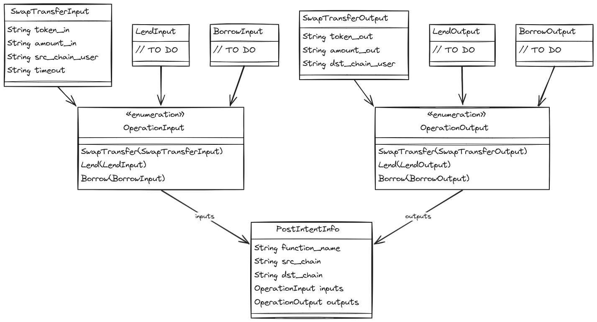
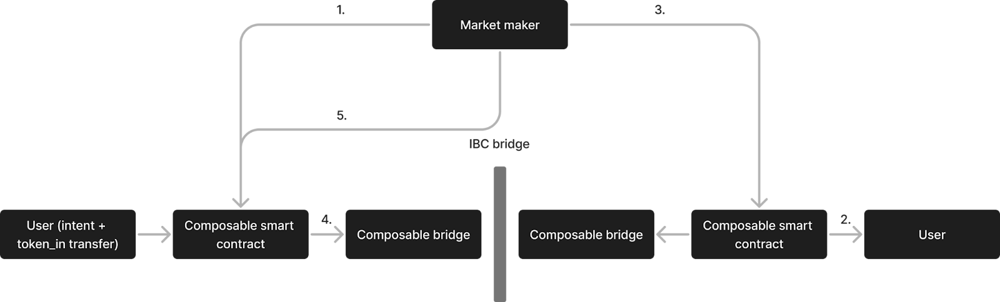

# Solvers

The solver role is critical to Mantis and the chain-agnostic execution of user intents. To summarize the role, a solver:

- Takes in data about users’ intents
- Comes up with a solution to fulfill these intents as transactions
- Is incentivized to perform this role

If you are interested in solving for Mantis or simply want to learn more about how Mantis solvers work, refer to the following:

- [Discovering Mantis Orders](https://github.com/ComposableFi/composable/blob/main/docs/docs/technology/mantis/tutorial.md)
- [Solving for Mantis](https://github.com/ComposableFi/composable/blob/main/docs/docs/technology/mantis/solver-tutorial.md)
- [Solver Integration](https://github.com/ComposableFi/composable/blob/main/docs/docs/technology/mantis/problem-solver-flow.md)

## How Solving on Mantis Works

On Mantis, solvers compete to deliver best execution for intents. The process for this is as follows:

1. Solvers must first be onboarded onto the Mantis network.
2. The solver obtains data on intents, which is stored in the problem mempool.
3. The solver uses an optimization algorithm to determine a solution route to settle the user intent at the best price.
4. Solvers send their proposed solution routes to the auctioneer.
5. The auctioneer scores proposed solutions. The winning solution is that which best suits the user’s intent and desired parameters.
6. The winning solver must execute the proposed solution for the user intent.
7. If the winning solver executes the path as specified, they are rewarded, If they do not, they are slashed. Initially, slashing will be permissioned and off-chain. [Pyth Network](https://pyth.network/)’s data streams will be used to measure the difference between how a solver executes a transaction against their proposed solution. Based on this, solver performance will be publicly displayed.

### Solver Interfaces and Mempool

The initial Mantis implementation will have solvers directly tap into the sequencer to query the problem mempool. In the future, we will introduce other privacy mechanisms on our rollup to prevent intent and solution data leakage.

### Types of Orders, Venues, and Solutions

Orders will be submitted privately to Mantis on a remote procedure call (RPC).

**Mantis accepts both cross-chain and single domain orders.** Initially, Mantis will be compatible with swaps. Later, Mantis will be able to accept many order types: time-weighted average prices, bracket orders, looping, block trades, conditional trades, centralized exchange interactions, and intent-based bridging.

Mantis can also interact with a range of protocols, from basic to complicated. The eventual goal is to facilitate any functionality, so long as it is on an IBC-connected chain (e.g. those connected by [Picasso](https://docs.picasso.network/)).

Solutions to orders can be a combination of any of the following settlement/execution pathways:

- [**Coincidence of Wants (CoWs)**](https://docs.cow.fi/cow-protocol/concepts/how-it-works/coincidence-of-wants#:~:text=CoW%20%28Coincidence%20of%20Wants%29%3A,re%20trading%20the%20same%20assets.)**:** CoWs allows intents to be matched with each other. This can be done on the same chain or even cross-chain. This eliminates the need for a third party intermediary in the exchange, as user funds can be directly swapped. This further eliminates any fees or delays associated with an intermediary actor.
- **Routes:** This solution path involves routing through constant function market makers (CFMMs), which are a subset of automated market makers (AMMs). CFMMs in DeFi have vast liquidity that solvers on Mantis can use to settle user intents.
- **Requests for Quote (RFQ):** Solvers request quotes from sellers for settling a user intent. RFQs prioritizes the transaction initiator’s best interests via a competition of other actors trying to fulfill the other side of their trade.
- **Market makers’ own liquidity:** Solvers can provide funds themselves to settle a transaction. It is possible that solvers also collaborate to combine their own liquidity to fulfill any given intent.

## Syntax

This section outlines the syntax and structure of various data types used in Mantis. It focuses on the structures related to swap transfers, lending, and borrowing operations. It further includes explanations of the primary data structures and enums used to handle these operations. A special emphasis is put on the IntentInfo struct. The IntentInfo struct is particularly important as it consolidates the information needed for processing these operations. The LendInput, LendOutput, BorrowInput, and BorrowOutput structs are placeholders for future implementation.

### Data Structures

#### SwapTransferInput

This represents the input data for a swap transfer operation.

```
struct SwapTransferInput {

token_in: String,

amount_in: String,

src_chain_user: String,

timeout: String,

}
```

- **token_in**: The token being swapped in.
- **amount_in**: The amount of the token being swapped in.
- **src_chain_user**: The user initiating the swap on the source chain.
- **timeout**: The timeout duration for the swap.

#### SwapTransferOutput

This represents the output data for a swap transfer operation.

```
struct SwapTransferOutput {

token_out: String,

amount_out: String,

dst_chain_user: String,

}
```

- **token_out**: The token being received in the swap.
- **amount_out**: The amount of the token being received.
- **dst_chain_user**: The user receiving the token on the destination chain.

#### LendInput and LendOutput

These structs represent the input and output data for a lending operation. They are currently marked as TODO.

```
struct LendInput {

// TODO

}

struct LendOutput {

// TODO

}
```

#### BorrowInput and BorrowOutput

These structs represent the input and output data for a borrowing operation. They are currently marked as TODO.

```
struct BorrowInput {

// TODO

}
```

```
struct BorrowOutput {

// TODO

}
```

### Enums

#### OperationInput

This encapsulates the different types of operation inputs.

```
enum OperationInput {

SwapTransfer(SwapTransferInput),

Lend(LendInput),

Borrow(BorrowInput),

}
```

- **SwapTransfer**: Holds a SwapTransferInput.
- **Lend**: Holds a LendInput.
- **Borrow**: Holds a BorrowInput.

#### OperationOutput

This encapsulates the different types of operation outputs.

```
enum OperationOutput {

SwapTransfer(SwapTransferOutput),

Lend(LendOutput),

Borrow(BorrowOutput),

}
```

- **SwapTransfer**: Holds a SwapTransferOutput.
- **Lend**: Holds a LendOutput.
- **Borrow**: Holds a BorrowOutput.

### IntentInfo

This struct encapsulates the overall intent information for an operation.

```
struct IntentInfo {

function_name: String,

src_chain: String,

dst_chain: String,

inputs: OperationInput,

outputs: OperationOutput,

}
```

- **function_name**: The name of the function being called.
- **src_chain**: The source blockchain for the operation.
- **dst_chain**: The destination blockchain for the operation.
- **inputs**: The inputs for the operation, represented by OperationInput.
- **outputs**: The outputs for the operation, represented by OperationOutput.

### Summary Diagram


## Solver Algorithm[​](https://docs.composable.finance/technology/mantis/solvers-solutions#solver-algorithm)

On Mantis, solvers need to come up with the best routes for users’ intents. This involves determining the best price. An algorithm is used by solvers to determine such optimal solution routes.

An example Mantis solver algorithm can be viewed [here](https://github.com/ComposableFi/cvm/tree/main/mantis/node/src/solver). The mathematical process with which we generated and tested this algorithm is detailed in [this paper by Composable and Bruno Mazorra.](https://github.com/ComposableFi/composable-vm/blob/44f02baf990c16b003a51a85a50a97a1d24e7c1e/Cross-Domain-COWs-%26-Constant-Function-MM-Routing.pdf)

### Fast Withdrawals

We are implementing an architecture that allows fast withdrawals from swaps along our IBC-connected infrastructure. Users will be able to indicate they would like to participate in fast withdrawal as a part of their intent specifications. Initially, fast withdrawals will only be supported for limit orders.

A contract on both sides (i.e. both the source chain and the destination chain) allows the user to get their funds from the market maker quickly. A USDT pool on both sides of the transaction enables USDT to be quickly transferred in this manner. The market maker will be able to tap into an endpoint for rebalancing. The market maker can swap out of this pool.

This works as follows:

1. A user submits an intent and opts for fast withdrawal. Market makers listen to new intents being broadcast to the Mantis smart contract (which communicates with the Picasso IBC bridge).
2. Market makers distribute USDT to the user through the Mantis smart contract.
3. The market maker asks the smart contract to be sure these tokens were sent to the user. The smart contract on the destination chain sends a cross-chain message indicating this to a smart contract on the destination chain.
4. A cross-chain message is sent allowing the market maker to claim the USDT from an intent.
5. The market maker claims the USDT tokens.

This is shown below, with the numbers representing the corresponding steps above:


## Scoring

# Failure

\[add what happens in the event of txn failure - TBD\]

## Conditional Intents
While intents in decentralized finance (DeFi) are often described as a broad concept, current intent-based applications typically focus on a limited set of intent types. These commonly take the form of limit orders or bridge transactions, such as:

1. "Trade asset A for asset B with a minimum price p"
2. "Transfer asset A to domain Z"

However, the theoretical potential of intents extends far beyond these basic use cases. Ideally, intents should serve as a tool allowing agents to express "arbitrary" preferences over state transitions within a single domain or across multiple domains. 
In economic literature, limit price-type intents can be conceptualized as expressions of an agent's private valuations over assets. Private valuations refer to the subjective worth an individual assigns to an asset, independent of others' opinions or market conditions. For instance, an individual might value a rare coin based on personal interest or sentimental attachment, regardless of its market price (also known as Walrasian demands).

However, it's crucial to recognize that users and agents often do not operate solely on private valuations. In reality, economic actors are interdependent, and their valuations of certain objects can depend significantly on the valuations of others. A prime example of this phenomenon is the valuation of digital art.

In such cases, if no one expresses any valuation for an item, people generally wouldn't value it. Conversely, when an item experiences high demand, agents often interpret this demand as a positive signal, indicating that the item possesses some intrinsic value. This concept aligns with the greater fool theory and speculative bubbles in financial markets.

Given this reality, intents should be capable of capturing these interdependent valuations. Many items are not valued in isolation from the world (unlike, for example, consuming an apple, which is generally independent of others' consumption). Instead, their value is deeply intertwined with other agents' valuations.

Natural examples of interdependent valuations that could be expressed through more sophisticated intents include:

1. Stop-losses: An order to sell an asset when it reaches a certain price, reflecting a valuation dependent on market movements.
2. Bidding in NFT auctions: Where the perceived value of an NFT can be influenced by the bids of other participants.
3. Copy-trading strategies: Where an agent's trading decisions are based on the actions of another trader (use other traders actions as positive or negative signals).
4. Dynamic liquidity provision: Adjusting liquidity based on market volatility or trading volume.
5. Trading conditional to prediction market quotes on real events.

By expanding the concept of intents to encompass these interdependent valuations, DeFi protocols and users can more accurately reflect the complex decision-making processes of market participants. This evolution could lead to more efficient markets, improved price discovery mechanisms, and a closer alignment between DeFi systems and real-world economic behaviors. We call this subset of intents conditional intents, emphasizing that the execution of such is conditioned to external signals or events.

Because intents on Mantis are generalized, artificial intelligence (AI) agents will be capable of submitting time-based conditional intents through the protocol. For example, a user may want to make a particular swap at the best price within the next 48 hours. They provide this information to the AI agent, which makes a prediction about when the best price will be within this time constraint. Then, at this time, the AI agent submits an intent to carry out the swap to Mantis. This abstracts conditionality away from solvers and puts it in the hands of AI agents who likely have more powerful algorithms to determine the best timing of swaps. Then, solvers are left to handle identification and execution of the best transaction route at that time. In this manner, the strengths and optimizations of the Mantis protocol and of AI agents are able to synergize, providing the best execution. 
