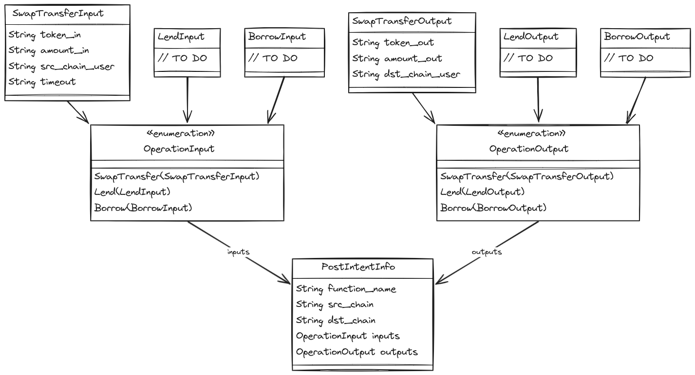
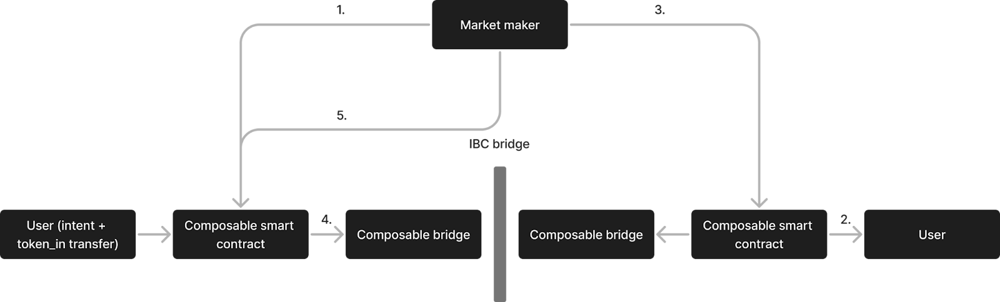
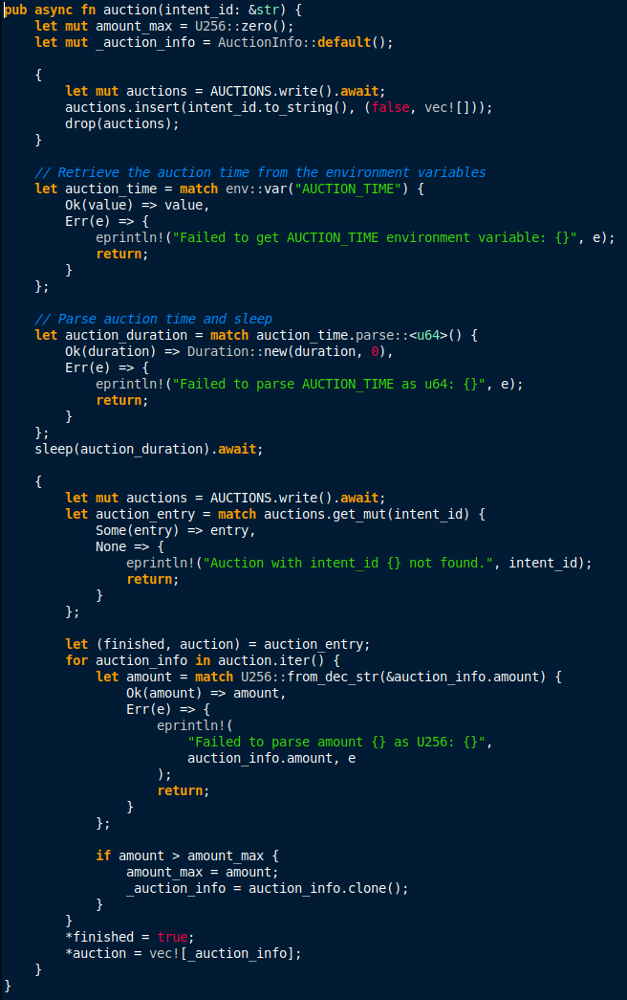

# Solvers

The solver role is critical to Mantis and the chain-agnostic execution of user intents. To summarize the role, a solver:

- Takes in data about users’ intents
- Comes up with a solution to fulfill these intents as transactions
- Is incentivized to perform this role

If you are interested in solving for Mantis or simply want to learn more about how Mantis solvers work, refer to the following:

- [Discovering Mantis Orders](https://github.com/ComposableFi/composable/blob/main/docs/docs/technology/mantis/tutorial.md)
- [Solving for Mantis](https://github.com/ComposableFi/composable/blob/main/docs/docs/technology/mantis/solver-tutorial.md)
- [Solver Integration](https://github.com/ComposableFi/composable/blob/main/docs/docs/technology/mantis/problem-solver-flow.md)

## How Solving on Mantis Works

On Mantis, solvers compete to deliver best execution for intents. The process for this is as follows:

1. Solvers must first be onboarded onto the Mantis network.
2. The solver obtains data on intents, which is stored in the problem mempool.
3. The solver uses an optimization algorithm to determine a solution route to settle the user intent at the best price.
4. Solvers send their proposed solution routes to the auctioneer.
5. The auctioneer scores proposed solutions. The winning solution is that which best suits the user’s intent and desired parameters.
6. The winning solver must execute the proposed solution for the user intent.
7. If the winning solver executes the path as specified, they are rewarded, If they do not, they are slashed. Initially, slashing will be permissioned and off-chain. [Pyth Network](https://pyth.network/)’s data streams will be used to measure the difference between how a solver executes a transaction against their proposed solution. Based on this, solver performance will be publicly displayed.

### Types of Orders, Venues, and Solutions

Orders will be submitted privately to Mantis on a remote procedure call (RPC).

**Mantis accepts both cross-chain and single domain orders.** Initially, Mantis will be compatible with swaps. Later, Mantis will be able to accept many order types: time-weighted average prices, bracket orders, looping, block trades, conditional trades, centralized exchange interactions, and intent-based bridging.

Mantis can also interact with a range of protocols, from basic to complicated. The eventual goal is to facilitate any functionality, so long as it is on an IBC-connected chain (e.g. those connected by [Picasso](https://docs.picasso.network/)).

Initially, solvers can generate solutions to intents by:

- **Requests for Quotes (RFQs):** RFQ is a type of quote-driven trading where a buyer essentially invites sellers to bid on the transaction/sale. RFQ prioritizes the transaction initiator’s best interests via a competition of other actors trying to fulfill the other side of their trade. On Mantis, solvers send out RFQs to get the best prices possible from constant function market makers (CFMMs), which are a subset of automated market makers (AMMs). CFMMs in DeFi have vast liquidity that solvers on Mantis can use to settle user intents.

In the future, we will incorporate additional settlement/execution pathways, which can be used alone or in combination with other enabled pathways. These future execution paths will include:

- [**Coincidence of Wants (CoWs)**](https://docs.cow.fi/cow-protocol/concepts/how-it-works/coincidence-of-wants#:~:text=CoW%20%28Coincidence%20of%20Wants%29%3A,re%20trading%20the%20same%20assets.)**:** CoWs allows intents to be matched with each other. This can be done on the same chain or even cross-chain. This eliminates the need for a third party intermediary in the exchange, as user funds can be directly swapped. This further eliminates any fees or delays associated with an intermediary actor.

## Syntax

This section outlines the syntax and structure of various data types used in Mantis. It focuses on the structures related to swap transfers, lending, and borrowing operations. It further includes explanations of the primary data structures and enums used to handle these operations. A special emphasis is put on the IntentInfo struct. The IntentInfo struct is particularly important as it consolidates the information needed for processing these operations. The LendInput, LendOutput, BorrowInput, and BorrowOutput structs are placeholders for future implementation.

### Data Structures

#### SwapTransferInput

This represents the input data for a swap transfer operation.

```

struct SwapTransferInput {

token_in: String,

amount_in: String,

src_chain_user: String,

timeout: String,

}
```


- **token_in**: The token being swapped in.
- **amount_in**: The amount of the token being swapped in.
- **src_chain_user**: The user initiating the swap on the source chain.
- **timeout**: The timeout duration for the swap.

#### SwapTransferOutput

This represents the output data for a swap transfer operation.
```

struct SwapTransferOutput {

token_out: String,

amount_out: String,

dst_chain_user: String,

}
```


- **token_out**: The token being received in the swap.
- **amount_out**: The amount of the token being received.
- **dst_chain_user**: The user receiving the token on the destination chain.

### Enums

#### OperationInput

This encapsulates the different types of operation inputs.

```
enum OperationInput {

SwapTransfer(SwapTransferInput),

Lend(LendInput),

Borrow(BorrowInput),

}
```

- **SwapTransfer**: Holds a SwapTransferInput.
- **Lend**: Holds a LendInput.
- **Borrow**: Holds a BorrowInput.

#### OperationOutput

This encapsulates the different types of operation outputs.

```
enum OperationOutput {

SwapTransfer(SwapTransferOutput),

Lend(LendOutput),

Borrow(BorrowOutput),

}
```

- **SwapTransfer**: Holds a SwapTransferOutput.
- **Lend**: Holds a LendOutput.
- **Borrow**: Holds a BorrowOutput.

### IntentInfo

This struct encapsulates the overall intent information for an operation.

```
struct IntentInfo {

function_name: String,

src_chain: String,

dst_chain: String,

inputs: OperationInput,

outputs: OperationOutput,

}
```

- **function_name**: The name of the function being called.
- **src_chain**: The source blockchain for the operation.
- **dst_chain**: The destination blockchain for the operation.
- **inputs**: The inputs for the operation, represented by OperationInput.
- **outputs**: The outputs for the operation, represented by OperationOutput.

### Summary Diagram


## Solver Algorithm[​](https://docs.composable.finance/technology/mantis/solvers-solutions#solver-algorithm)

On Mantis, solvers need to come up with the best routes for users’ intents. This involves determining the best price. An algorithm is used by solvers to determine such optimal solution routes.

An example Mantis solver algorithm can be viewed [here](https://github.com/ComposableFi/cvm/tree/main/mantis/node/src/solver). The mathematical process with which we generated and tested this algorithm is detailed in [this paper by Composable and Bruno Mazorra.](https://github.com/ComposableFi/composable-vm/blob/44f02baf990c16b003a51a85a50a97a1d24e7c1e/Cross-Domain-COWs-%26-Constant-Function-MM-Routing.pdf) See an [example solver](https://github.com/ComposableFi/example_solver) for more details. Note that the solver’s code might be outdated.

### Fast Bridge

We have implemented an architecture that allows fast bridging of swaps along our IBC-connected infrastructure. A contract on both sides (i.e. both the source chain and the destination chain) allows the user to get their funds from the market maker quickly. A USDT pool on both sides of the transaction enables USDT to be quickly transferred in this manner. The market maker will be able to tap into an endpoint for rebalancing. The market maker can swap out of this pool. 

This works as follows:
1. A user submits an intent and opts for fast bridging. Market makers listen to new intents being broadcast to the Mantis smart contract (which communicates with the Picasso IBC bridge).
2. Market makers distribute USDT to the user through the Mantis smart contract.
3. The market maker asks the smart contract to be sure these tokens were sent to the user. The smart contract on the destination chain sends a cross-chain message indicating this to a smart contract on the destination chain.
4. A cross-chain message is sent allowing the market maker to claim the USDT from an intent.
5. The market maker claims the USDT tokens.

This is shown below, with the numbers representing the corresponding steps above:




# Auctions

Each intent’s right of execution is auctioned through a mechanism similar to an English auction. The solver that commits to maximize the intent’s utility, as determined by the scoring rule, is allocated the right to execute it.

## Auctioneer
Although the Auctioneer exists off-chain to execute the store_intent() function on relevant chains, Solvers can detect any dishonest behavior. Since Solvers will also listen to intents on the Rollup, they can compare these with what the Auctioneer stores on-chain. If there’s a discrepancy, Solvers will know the Auctioneer is cheating.  



## Scoring

Scoring intents depends on the type of intent that a user is given. Fundamentally, an intent can be encapsulated as a utility function of the user that maps different states to real numbers that express the utility of that transition. Therefore, the scoring of such intent is the utility that the solver assigns in terms of its utility function.

For example, let's assume that a user on Osmosis wants to lend at least X amount of DAI on the MakerDAO protocol by providing Y amount of USDC in the Osmosis escrow contract. The solutions are ordered by the agent that commits to lend more tokens on the MakerDAO contract via Osmosis. The solver takes the difference between Y and the amount committed. In this way, the solver is essentially pricing the cost of bridging and lending the tokens.

A similar idea applies to trading. For instance, consider a user who wants to swap token A for token B on Osmosis. The user's intent might be to receive at least Z amount of token B for their token A. In this case, the scoring function would prioritize solutions that provide the most token B for the given amount of token A. The solver would calculate the effective exchange rate and compare it to the user's minimum acceptable rate.

The solutions could be ranked based on:

1. The amount of token B provided
2. The slippage incurred
3. The speed of execution
4. Any additional fees or costs involved in the swap

The solver would then assign a utility value to each potential solution based on these factors, with higher utility scores given to solutions that best meet or exceed the user's specified intent. This allows the system to efficiently identify and execute the most favorable trade for the user within the constraints of their intent.

### Auction Timeline

- The auction begins when the intent is stored in the rollup.
- It concludes after the predetermined AUCTION_TIMEOUT period.

### Auction Mechanism

- The auction is conducted in an English auction style that ends at specific time AUCTION_TIMEOUT in the auction smart contract.
- Solvers can place bids until the auction ends, with each new bid required to exceed the previous one.

### Post-Auction

- Upon auction completion, the auctioneer:
  - Emits an event announcing the winning solver.
  - Records the intent and solver solution on the destination chain.
- The winning solver can then execute its solution on the destination chain.

## Failure

There are three types of fundamental failures in this system:

1. No solvers have committed to provide any solution.
2. A solver has committed to a solution but has not provided it.
3. IBC relay stops working.

In the first case, once the auctioneer records this failure in the escrow contract, the user can withdraw the tokens they originally escrowed.

In the second case, where a solver has committed to a solution but has not provided it before the timeout period expires, an IBC proof is sent from the destination chain to the source chain. This proof allows the user to withdraw their funds from the escrow contract on the source chain.

In the third case, either the user's or solver's funds (depending on whether the solution has been solved or not) are stuck in the escrow contract until an IBC relay functions properly and the cross-domain message is received by the escrow contract.

These mechanisms ensure that users can recover their assets in case of system failures or non-performance by solvers, maintaining the safety and reliability of the cross-chain operations.

## Execution and Penalties

If a solver fails to properly execute the solution:

- A timeout period is initiated.
- The timeout increases exponentially with each subsequent failed solution attempt.

If the executed solution doesn't match the committed solution:

- The agent will be unable to withdraw user funds.

## Costs

Costs on the Mantis Protocol include Protocol Fees and Submission Gas

## Protocol Fees

Introductory fees (protocol fees) are as follows:

- Solana single domain: 0.1% of the token in
- Ethereum single domain: 0.1% of the token in

## Submission Gas Cost

There will also be a gas fee associated with submitting the intents on chain. This amount is set and charged by the network where the intents are submitted, not Mantis. The submission gas costs for cross domain intents are as follows:

**Solana to Ethereum:**

- Gas Cost: approximately $30 gas in SOL (0.1682 SOL) (calculated dynamically)
- Protocol Fee: 0.015 sol + 0.04%
- An additional fee of 0.25% of token in

**Ethereum to Solana:**

- Gas Cost: approximately $30 gas in ETH (calculated dynamically)
- Protocol fee: 0.001 ETH + 0.04%
- An additional fee of 0.25% of token in