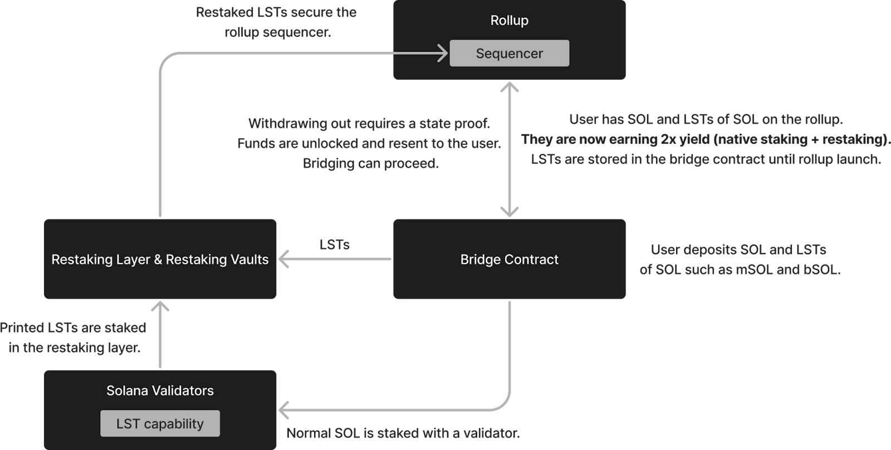

# Bridge Contract

## Deposits

A bridge contract interacts with the Mantis rollup to facilitate the movement of assets. Any asset can be deposited into the bridge contract to be staked in proof-of-stake validation and provide staking rewards. Deposits of SOL or any of a number of liquid staked tokens (LSTs) from SOL earn additional yield in the form of restaking, DeFi integrations, and native yield:

### Restaking

**Accepted assets: SOL and SOL-based LSTs**

SOL deposited into the Mantis bridge contract is staked with Solana validators for proof-of-stake validation in [Picasso’s Restaking Layer](https://docs.picasso.network/technology/restaking). Staked SOL will be represented by an LST. Users can then choose to also restake their LSTs into the Solana Restaking Layer. This provides doubled staking yield while abstracting away the additional steps for users to perform restaking on their own.

Any LSTs that have been directly deposited into the bridge contract also flow to the restaking vault. The resulting crypto-economic security can be leveraged by the Mantis rollup and other Actively Validated Services (AVSes) paying for this security.

Tokens that have been restaked in this Restaking Layer will be used to secure the sequencers of the Mantis Solana-based rollup.

### DeFi Integrations

**Accepted assets: SOL-based LSTs and Solana native stablecoins**

LSTs generated from staking SOL via the bridge contract are deposited into lending protocols, initially [marginfi](https://www.marginfi.com/). This provides the user with additional yield.

Any Solana-native stablecoins deposited into the bridge contract will also be routed to these lending protocols. The user can then choose to restake their stablecoins into the Solana restaking layer. This also results in double yield for the user.

### Native Yield

**Accepted assets: SOL or any assets in Mantis Accounts on the Mantis rollup**

Users can stake SOL tokens directly into [mantis.app](https://www.mantis.app/). These SOL are then delegated on the backend to Solana validators. This will allow users to accrue native yield, just as they normally would from using their SOL for proof-of-stake validation on Solana. Users will also receive an LST to represent their SOL stake. Users will earn additional rewards from opting into restaking this LST. This enhances their overall yield from the same amount of underlying assets.

Mantis Accounts also facilitate native yield for other asset types. Mantis Accounts are network-level accounts that can be used for participating in on-chain actions. Mantis Account users will earn native yield for any assets deposited to the Mantis rollup from their account. Therefore, assets held in Mantis Accounts earn yield even when not actively being used.

Native staking and restaking in Mantis can be combined in the Mantis framework streamlining the (re)staking process for users:

#### MantisSol

MantisSol is the LST generated from staking SOL on Mantis. It is the native token of the Mantis rollup and can be used to pay Mantis network fees.

## Withdrawals

Withdrawals of (re)staked tokens are done as IBC transfers. Funds are unlocked and sent back to the user in the form in which they were deposited. For example, if a user deposited SOL, SOL will be returned to them. The user can then bridge their tokens to other locations or perform other functionalities with them again over IBC.
