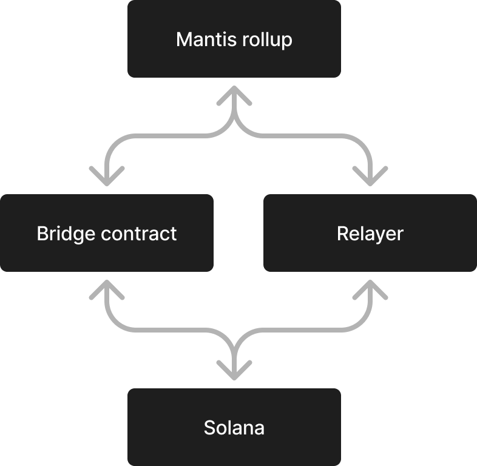
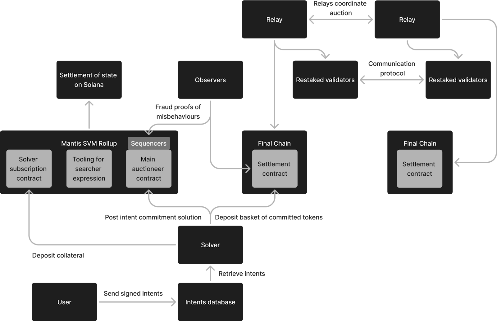

# The Mantis Rollup

A core component of Mantis is the Mantis rollup. Previously, rollups have been limited to the optimistic or ZK rollups in the Ethereum ecosystem. To meet its own unique needs, Mantis created its own rollup design on Solana.

In this design, the bridge contract is used to move assets between Solana and Mantis. A relayer is also used to send information between these two ecosystems:

We are pleased to be introducing the first rollup on Solana in the form of the Mantis rollup. We hope that this can set a new standard to introduce the benefits of rollups to the Solana ecosystem. As a result, Solana-based applications and frameworks can be more performant and scalable. Moreover, the user experience can be improved through increased security and speed as well as reduced cost.

The Mantis rollup’s core role is to be a coordination and settlement layer for cross-domain, intent-based mechanisms of the Mantis protocol. The Mantis rollup also provides a framework for block proposals and credible commitments across domains. These commitments are held accountable through IBC’s security model, ensuring transparency and trust in multi-chain interactions.

Components of the Mantis rollup are depicted in the following diagram:

# Our Unique SVM Rollup Approach

### Solana IBC

The Mantis rollup makes use of the [Picasso Network’s](https://www.picasso.network/) [Solana IBC](https://docs.picasso.network/technology/ibc/solana) connection. This connection links Solana to the [Inter-Blockchain Communication (IBC) Protocol](https://docs.picasso.network/technology/ibc/solana). IBC is a protocol for trust-minimized cross-chain communication. Initially, IBC was created to connect the [Cosmos Hub](https://hub.cosmos.network/) and [Cosmos SDK](https://v1.cosmos.network/sdk) chains. Picasso has expanded IBC to connect [Ethereum](https://ethereum.org/en/) and [Solana](https://solana.com/), with plans for connecting other protocols like Bitcoin in the future.

Solana IBC in particular is used on Mantis to settle transactions down from the Mantis rollup to its layer 1 chain, Solana.

Data that is posted to the L1 includes:

- The block header
- The trie root commitment

The “guest blockchain” approach enables Solana IBC. We have already reported upon our guest blockchain design in detail [here](https://research.composable.finance/t/crossing-the-cross-blockchain-interoperability-chasm/33) and [here](https://research.composable.finance/t/how-the-guest-blockchain-for-solana-ibc-differs-from-a-solo-machine-solution/317). The guest blockchain was developed in conjunction with our collaborators on the research team at [INESC-ID Distributed Systems Group](https://www.dpss.inesc-id.pt/), associated with the University of Lisbon.

To summarize, this design includes the creation of a new blockchain (the _guest blockchain_) that functions atop a non-IBC-compatible chain (the _host blockchain_). The guest blockchain functions similarly to a layer 2 of the underlying host chain, but meets all IBC requirements by implementing state proofs. Thus, the host chain is able to interoperate with the IBC via the guest chain. Initially, we have implemented this approach for the Solana blockchain.

### Alternative Proofs

The guest blockchain solution is quite developmentally intensive, and must be customized for each chain and whatever IBC requirements the chain is missing. Thus, we have sought a means to replicate state proofs on the SVM itself (including on the Mantis rollup). We do not use ZK or Optimistic proofs, instead creating our own approach. We use the following main mechanisms to deliver IBC-compatible proofs on Solana:

**The Accounts Delta Hash:**

This alternative proof system uses Solana’s accounts delta Merkle tree. The tree stores all accounts which have changed within a particular Solana slot. This enables proof generation of an account's value whenever it changes. The commitment of the accounts delta tree (an _accounts delta hash_) is encoded within Solana’s bankhash which allows light clients to verify such proofs.

However, this process alone is not enough. If an account hasn’t changed, it’s not possible to prove the account’s value. Moreover, it is inefficient to have to create a new Program Derived Addressaccount (PDA) for each key-value pair an IBC module might need to store.

**A Witnessed Trie:**

Therefore, we also introduce an on-chain, witnessed sealable trie. This is the same trie we leverage in the guest blockchain solution. This trie offers state proofs. Therefore, the only remaining factor needed for finality is this trie’s state commitment. To address this, we introduce a witness account storing state commitment that stays in sync with the trie. As a result, the trie’s state commitment is provable via the account’s delta hash.

By combining these components, we have created an alternative proof that meets the state proof requirements of the IBC. Thus, the SVM rollup is able to have finality. For more technical details on this alternative proof mechanism, reference [this research forum post by Michał Nazarewicz](https://research.composable.finance/t/mantis-svm-rollup/333).

### Security and Validation from the Solana L1

True rollups are able to deliver the same security guarantees of their underlying L1. Without this characteristic, the Mantis rollup would simply be a sidechain and it would not inherit the security of Solana. This would have meant we would have needed to bootstrap our own security system. Instead, we implement all rollup requirements into the Mantis L2, including censorship resistance and forced withdrawals. This is accomplished via the IBC: we post proofs down to Solana from the Mantis rollup via IBC, and these proofs are verified by validators on our guest blockchain. As a result, the Mantis rollup is validated by guest blockchain validators, inheriting Solana’s security.

### Instant Withdrawals - Avoiding the 7 Day Challenge Window

Another benefit of using IBC for our rollup is that we can avoid the lengthy challenge window that most rollups require.

[As per Optimism](https://community.optimism.io/docs/protocol/2-rollup-protocol/#fault-proofs),

_“In an Optimistic Rollup, state commitments are published to L1 (Ethereum in the case of OP Mainnet) without any direct proof of the validity of these commitments. Instead, these commitments are considered pending for a period of time (called the "challenge window"). If a proposed state commitment goes unchallenged for the duration of the challenge window (currently set to 7 days), then it is considered final. Once a commitment is considered final, smart contracts on Ethereum can safely accept withdrawal proofs about the state of OP Mainnet based on that commitment.”_

While they are important for ensuring validity, the 7 day challenge window of ORs causes significant delays in transaction processing. Therefore, it is advantageous for us to shorten this processing time on the Mantis rollup. We are able to omit having a challenge window on the Mantis rollup, as using IBC allows us to inherit the security and validation from the Solana L1.

# Privacy

On Mantis, we use a validator client to make order flow private. To continue to preserve the privacy of intents, we then run the auction to determine the winning solution within the mempool of the sequencer. Here, the intent is exposed to solvers competing to provide the best solution.

The only other entity that can see intents is the lead sequencer. On the Solana blockchain, the lead sequencer is a predetermined validator. Since there will initially only be one validator on the Mantis rollup, we can be the only lead sequencer and we will be able to preserve the privacy of transactions. This protects against frontrunning and other malicious forms of MEV that can result from transactions not being private. In the future, we will take a more decentralized approach to this process.