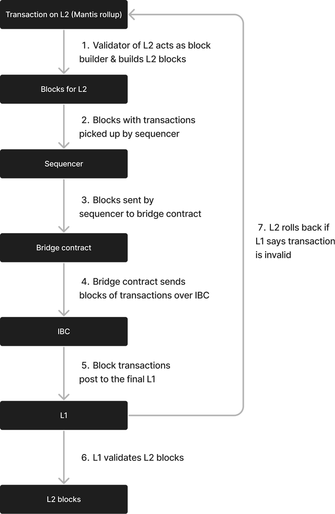

# Transaction Lifecycle

Transactions settle down from layer 2 (the Mantis rollup) to layer 1 (the destination chain of the transaction):

1. Transactions on the Mantis rollup are used to construct blocks by the Mantis rollup validators. In this way, rollup validators also act as block builders.
2. The blocks of Mantis rollup transactions are picked up by the sequencer on Mantis.
3. Sequencers send blocks to the Mantis bridge contract.
4. The bridge contract subsequently sends transactions out over IBC using a light client that we have created between L1 and L2.
5. Via the IBC, blocks of transactions post to the final layer 1.
6. The layer 1 validates the layer 2 blocks; if the L1 says a transaction/block is invalid, the layer 2 rolls back.

This is also a change in the consensus algorithm that ensures finality of the L2. This is a change to the validator client we’ve made.

This transaction lifecycle is depicted in the following diagram:

## Finality of the L1

As mentioned, the layer 1 that a transaction is being settled to validates the L2 Mantis rollup blocks. If the L1 says the transaction is invalid (i.e. the L1 does not accept the transaction), the Mantis rollup rolls back the transaction. The rollback fork choice for the Mantis rollup is based on the L1.

## Bridge Between L1 and L2

The IBC is used to settle transactions down from the Mantis rollup to the respective L1 destination chain. This is accomplished via the Picasso Network’s expansion of the IBC’s connections to not only the [Cosmos Hub](https://hub.cosmos.network/) and [Cosmos SDK](https://v1.cosmos.network/sdk) chains that it originally linked, but also [Polkadot](https://polkadot.network/) and [Kusama](https://kusama.network/) parachains, [Ethereum](https://ethereum.org/en/), and [Solana](https://solana.com/).

## Data Posted to the L1

Data that is posted to the L1 includes:

- The block header
- The [trie root commitment](https://research.composable.finance/t/state-proofs-on-solana/332)
