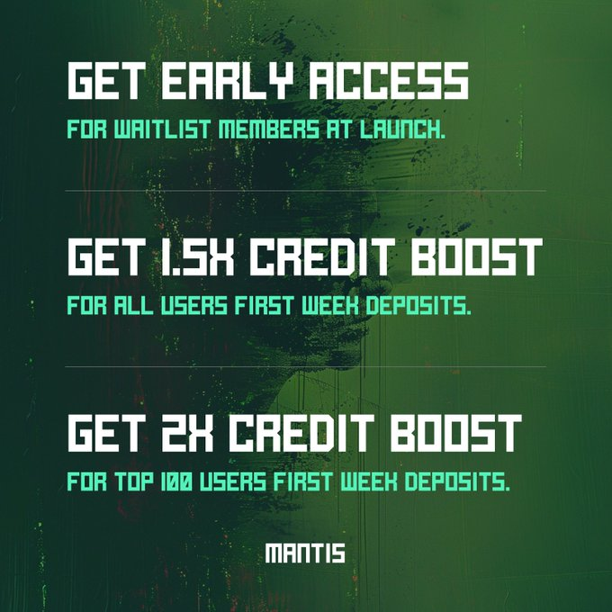
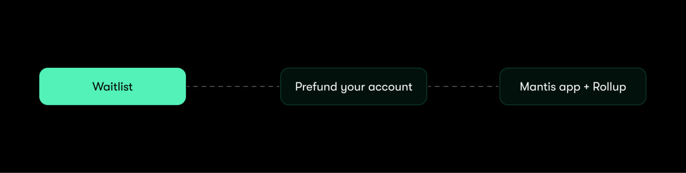
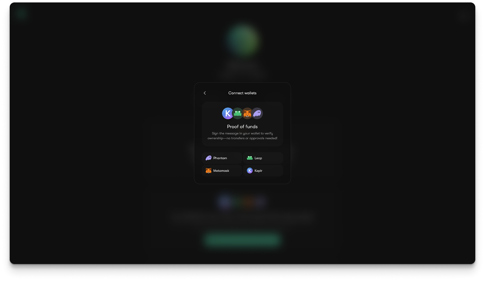
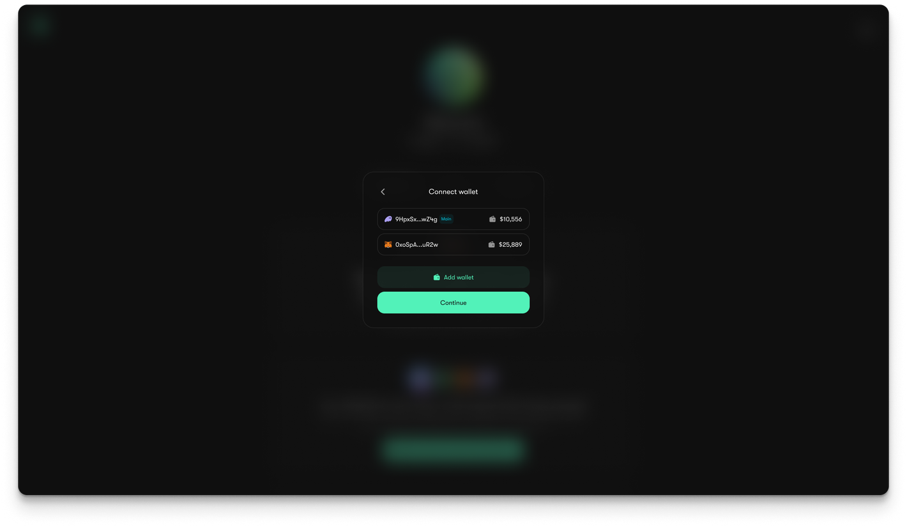
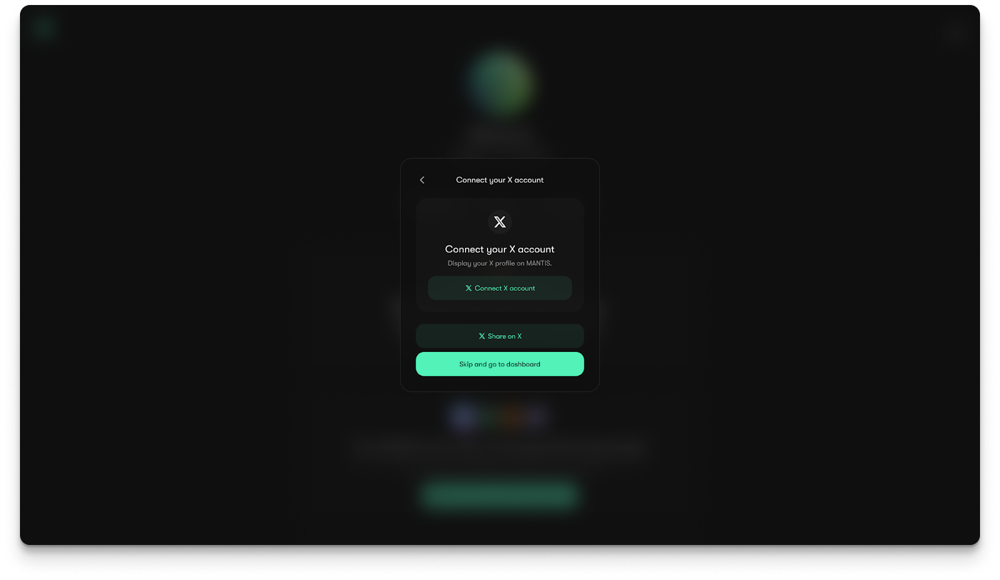
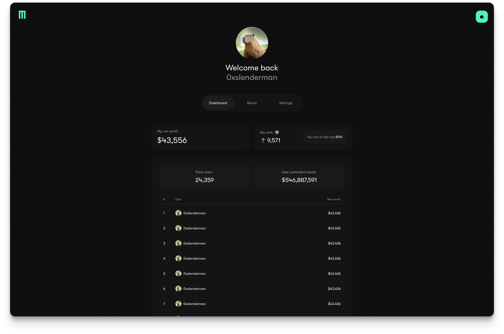

# Waitlist

We are holding a **waitlist period** for Mantis. Participants on the waitlist can sign a message and commit total value locked to the Mantis rollup from any chain. Then, they will get early access to Mantis features and become eligible for rewards:

The Mantis waitlist period will be followed by a **pre-launch campaign**. During this campaign, additional rewards will be made available to participants.

Thereafter, we will **launch the Mantis rollup**:

Follow the steps below to join the Mantis waitlist and become eligible for early protocol access and exclusive rewards:

1. Follow [this link](https://waitlist.mantis.app/), and click “Login with your wallet and get started”. Select the wallet you want to connect and approve it in the extension.

2. Connect more wallets, as you wish.

3. Connect X by logging into your account. This can also be connected later.

4. Check out the Dashboard to view your account history and stats. Your ranking on the dashboard is determined by the total number of funds that you commit to Mantis from any chain.
